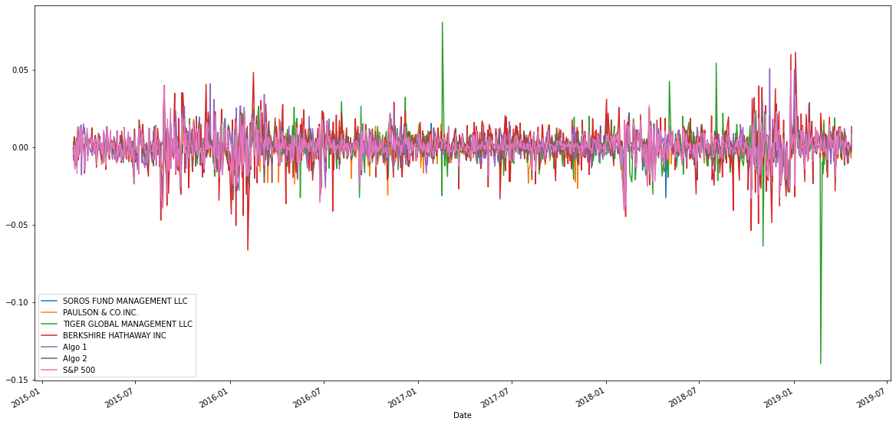
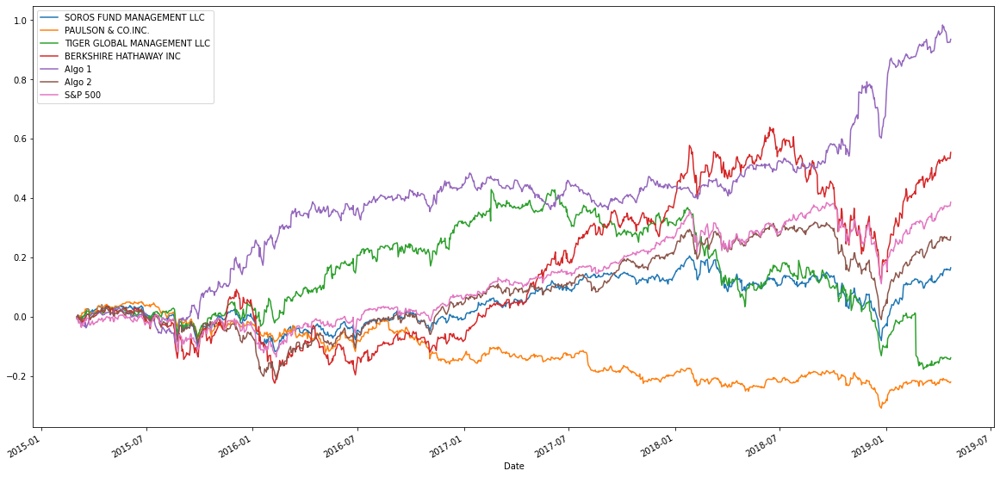
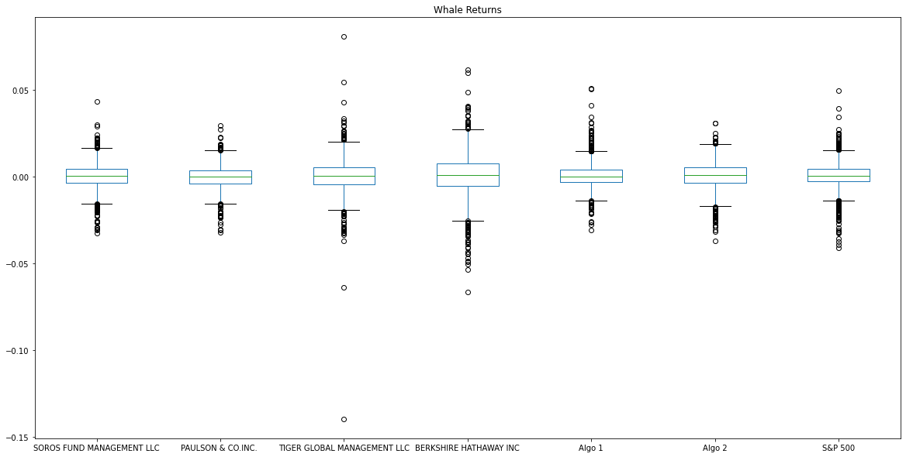
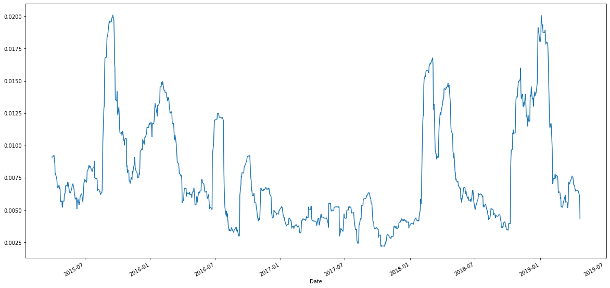
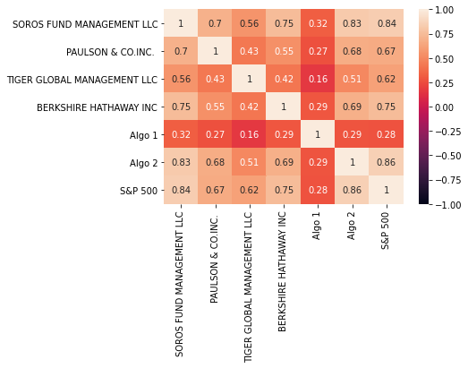
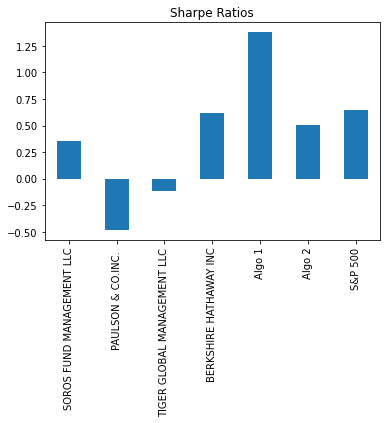
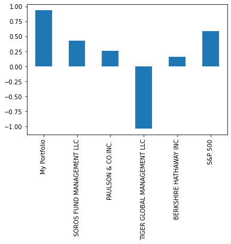
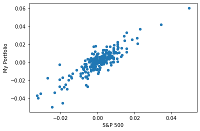

 #  A Whale off the Port(folio)

 In this assignment, you'll get to use what you've learned this week to evaluate the performance among various algorithmic, hedge, and mutual fund portfolios and compare them against the S&P 500.


```python
import pandas as pd
import numpy as np
import datetime as dt
from pathlib import Path
%matplotlib inline
```

# Data Cleaning

In this section, you will need to read the CSV files into DataFrames and perform any necessary data cleaning steps. After cleaning, combine all DataFrames into a single DataFrame.

Files:
1. whale_returns.csv
2. algo_returns.csv
3. sp500_history.csv


```python
# Reading whale returns
whale_path = Path("Resources/whale_returns.csv")
whale_returns = pd.read_csv(whale_path,index_col = 'Date',parse_dates= True,infer_datetime_format=True)
whale_returns.head()
```


<div>
<style scoped>
    .dataframe tbody tr th:only-of-type {
        vertical-align: middle;
    }

    .dataframe tbody tr th {
        vertical-align: top;
    }

    .dataframe thead th {
        text-align: right;
    }
</style>
<table border="1" class="dataframe">
  <thead>
    <tr style="text-align: right;">
      <th></th>
      <th>SOROS FUND MANAGEMENT LLC</th>
      <th>PAULSON &amp; CO.INC.</th>
      <th>TIGER GLOBAL MANAGEMENT LLC</th>
      <th>BERKSHIRE HATHAWAY INC</th>
    </tr>
    <tr>
      <th>Date</th>
      <th></th>
      <th></th>
      <th></th>
      <th></th>
    </tr>
  </thead>
  <tbody>
    <tr>
      <th>2015-03-02</th>
      <td>NaN</td>
      <td>NaN</td>
      <td>NaN</td>
      <td>NaN</td>
    </tr>
    <tr>
      <th>2015-03-03</th>
      <td>-0.001266</td>
      <td>-0.004981</td>
      <td>-0.000496</td>
      <td>-0.006569</td>
    </tr>
    <tr>
      <th>2015-03-04</th>
      <td>0.002230</td>
      <td>0.003241</td>
      <td>-0.002534</td>
      <td>0.004213</td>
    </tr>
    <tr>
      <th>2015-03-05</th>
      <td>0.004016</td>
      <td>0.004076</td>
      <td>0.002355</td>
      <td>0.006726</td>
    </tr>
    <tr>
      <th>2015-03-06</th>
      <td>-0.007905</td>
      <td>-0.003574</td>
      <td>-0.008481</td>
      <td>-0.013098</td>
    </tr>
  </tbody>
</table>
</div>


```python
# Count nulls
whale_returns.isnull().sum()
```


    SOROS FUND MANAGEMENT LLC      1
    PAULSON & CO.INC.              1
    TIGER GLOBAL MANAGEMENT LLC    1
    BERKSHIRE HATHAWAY INC         1
    dtype: int64


```python
# Drop nulls
whale_returns.dropna(inplace=True)
whale_returns.isnull()
```


<div>
<style scoped>
    .dataframe tbody tr th:only-of-type {
        vertical-align: middle;
    }

    .dataframe tbody tr th {
        vertical-align: top;
    }

    .dataframe thead th {
        text-align: right;
    }
</style>
<table border="1" class="dataframe">
  <thead>
    <tr style="text-align: right;">
      <th></th>
      <th>SOROS FUND MANAGEMENT LLC</th>
      <th>PAULSON &amp; CO.INC.</th>
      <th>TIGER GLOBAL MANAGEMENT LLC</th>
      <th>BERKSHIRE HATHAWAY INC</th>
    </tr>
    <tr>
      <th>Date</th>
      <th></th>
      <th></th>
      <th></th>
      <th></th>
    </tr>
  </thead>
  <tbody>
    <tr>
      <th>2015-03-03</th>
      <td>False</td>
      <td>False</td>
      <td>False</td>
      <td>False</td>
    </tr>
    <tr>
      <th>2015-03-04</th>
      <td>False</td>
      <td>False</td>
      <td>False</td>
      <td>False</td>
    </tr>
    <tr>
      <th>2015-03-05</th>
      <td>False</td>
      <td>False</td>
      <td>False</td>
      <td>False</td>
    </tr>
    <tr>
      <th>2015-03-06</th>
      <td>False</td>
      <td>False</td>
      <td>False</td>
      <td>False</td>
    </tr>
    <tr>
      <th>2015-03-09</th>
      <td>False</td>
      <td>False</td>
      <td>False</td>
      <td>False</td>
    </tr>
    <tr>
      <th>...</th>
      <td>...</td>
      <td>...</td>
      <td>...</td>
      <td>...</td>
    </tr>
    <tr>
      <th>2019-04-25</th>
      <td>False</td>
      <td>False</td>
      <td>False</td>
      <td>False</td>
    </tr>
    <tr>
      <th>2019-04-26</th>
      <td>False</td>
      <td>False</td>
      <td>False</td>
      <td>False</td>
    </tr>
    <tr>
      <th>2019-04-29</th>
      <td>False</td>
      <td>False</td>
      <td>False</td>
      <td>False</td>
    </tr>
    <tr>
      <th>2019-04-30</th>
      <td>False</td>
      <td>False</td>
      <td>False</td>
      <td>False</td>
    </tr>
    <tr>
      <th>2019-05-01</th>
      <td>False</td>
      <td>False</td>
      <td>False</td>
      <td>False</td>
    </tr>
  </tbody>
</table>
<p>1059 rows × 4 columns</p>
</div>


## Algorithmic Daily Returns

Read the algorithmic daily returns and clean the data


```python
# Reading algorithmic returns
algo_path = Path("Resources/algo_returns.csv")
algo_returns=pd.read_csv(algo_path,index_col = 'Date',parse_dates= True,infer_datetime_format=True)
algo_returns
```


<div>
<style scoped>
    .dataframe tbody tr th:only-of-type {
        vertical-align: middle;
    }

    .dataframe tbody tr th {
        vertical-align: top;
    }

    .dataframe thead th {
        text-align: right;
    }
</style>
<table border="1" class="dataframe">
  <thead>
    <tr style="text-align: right;">
      <th></th>
      <th>Algo 1</th>
      <th>Algo 2</th>
    </tr>
    <tr>
      <th>Date</th>
      <th></th>
      <th></th>
    </tr>
  </thead>
  <tbody>
    <tr>
      <th>2014-05-28</th>
      <td>0.001745</td>
      <td>NaN</td>
    </tr>
    <tr>
      <th>2014-05-29</th>
      <td>0.003978</td>
      <td>NaN</td>
    </tr>
    <tr>
      <th>2014-05-30</th>
      <td>0.004464</td>
      <td>NaN</td>
    </tr>
    <tr>
      <th>2014-06-02</th>
      <td>0.005692</td>
      <td>NaN</td>
    </tr>
    <tr>
      <th>2014-06-03</th>
      <td>0.005292</td>
      <td>NaN</td>
    </tr>
    <tr>
      <th>...</th>
      <td>...</td>
      <td>...</td>
    </tr>
    <tr>
      <th>2019-04-25</th>
      <td>0.000682</td>
      <td>-0.007247</td>
    </tr>
    <tr>
      <th>2019-04-26</th>
      <td>0.002981</td>
      <td>0.005256</td>
    </tr>
    <tr>
      <th>2019-04-29</th>
      <td>0.005208</td>
      <td>0.002829</td>
    </tr>
    <tr>
      <th>2019-04-30</th>
      <td>-0.002944</td>
      <td>-0.001570</td>
    </tr>
    <tr>
      <th>2019-05-01</th>
      <td>0.000094</td>
      <td>-0.007358</td>
    </tr>
  </tbody>
</table>
<p>1241 rows × 2 columns</p>
</div>


```python
# Count nulls
algo_returns.isnull().sum()
```


    Algo 1    0
    Algo 2    6
    dtype: int64


```python
# Drop nulls
algo_returns.dropna(inplace=True)
algo_returns.isnull().sum()
```


    Algo 1    0
    Algo 2    0
    dtype: int64


## S&P 500 Returns

Read the S&P500 Historic Closing Prices and create a new daily returns DataFrame from the data. 


```python
# Reading S&P 500 Closing Prices
sp500_path = Path("Resources/sp500_history.csv")
sp500_returns = pd.read_csv(sp500_path,index_col = 'Date',parse_dates= True,infer_datetime_format=True)
sp500_returns.sort_index(inplace=True)
sp500_returns
```


<div>
<style scoped>
    .dataframe tbody tr th:only-of-type {
        vertical-align: middle;
    }

    .dataframe tbody tr th {
        vertical-align: top;
    }

    .dataframe thead th {
        text-align: right;
    }
</style>
<table border="1" class="dataframe">
  <thead>
    <tr style="text-align: right;">
      <th></th>
      <th>Close</th>
    </tr>
    <tr>
      <th>Date</th>
      <th></th>
    </tr>
  </thead>
  <tbody>
    <tr>
      <th>2012-10-01</th>
      <td>$1444.49</td>
    </tr>
    <tr>
      <th>2012-10-02</th>
      <td>$1445.75</td>
    </tr>
    <tr>
      <th>2012-10-03</th>
      <td>$1450.99</td>
    </tr>
    <tr>
      <th>2012-10-04</th>
      <td>$1461.40</td>
    </tr>
    <tr>
      <th>2012-10-05</th>
      <td>$1460.93</td>
    </tr>
    <tr>
      <th>...</th>
      <td>...</td>
    </tr>
    <tr>
      <th>2019-04-16</th>
      <td>$2907.06</td>
    </tr>
    <tr>
      <th>2019-04-17</th>
      <td>$2900.45</td>
    </tr>
    <tr>
      <th>2019-04-18</th>
      <td>$2905.03</td>
    </tr>
    <tr>
      <th>2019-04-22</th>
      <td>$2907.97</td>
    </tr>
    <tr>
      <th>2019-04-23</th>
      <td>$2933.68</td>
    </tr>
  </tbody>
</table>
<p>1649 rows × 1 columns</p>
</div>


```python
# Check Data Types
sp500_returns.dtypes
```


    Close    object
    dtype: object


```python
# Fix Data Types
sp500_returns['Close'] = sp500_returns['Close'].str.replace('$','').astype('float64')
sp500_returns.dtypes
```


    Close    float64
    dtype: object


```python
# Calculate Daily Returns
sp500_daily = sp500_returns.pct_change()
sp500_daily
```


<div>
<style scoped>
    .dataframe tbody tr th:only-of-type {
        vertical-align: middle;
    }

    .dataframe tbody tr th {
        vertical-align: top;
    }

    .dataframe thead th {
        text-align: right;
    }
</style>
<table border="1" class="dataframe">
  <thead>
    <tr style="text-align: right;">
      <th></th>
      <th>Close</th>
    </tr>
    <tr>
      <th>Date</th>
      <th></th>
    </tr>
  </thead>
  <tbody>
    <tr>
      <th>2012-10-01</th>
      <td>NaN</td>
    </tr>
    <tr>
      <th>2012-10-02</th>
      <td>0.000872</td>
    </tr>
    <tr>
      <th>2012-10-03</th>
      <td>0.003624</td>
    </tr>
    <tr>
      <th>2012-10-04</th>
      <td>0.007174</td>
    </tr>
    <tr>
      <th>2012-10-05</th>
      <td>-0.000322</td>
    </tr>
    <tr>
      <th>...</th>
      <td>...</td>
    </tr>
    <tr>
      <th>2019-04-16</th>
      <td>0.000509</td>
    </tr>
    <tr>
      <th>2019-04-17</th>
      <td>-0.002274</td>
    </tr>
    <tr>
      <th>2019-04-18</th>
      <td>0.001579</td>
    </tr>
    <tr>
      <th>2019-04-22</th>
      <td>0.001012</td>
    </tr>
    <tr>
      <th>2019-04-23</th>
      <td>0.008841</td>
    </tr>
  </tbody>
</table>
<p>1649 rows × 1 columns</p>
</div>


```python
# Drop nulls
sp500_daily.dropna(inplace=True)
sp500_daily.sort_index()
sp500_daily
```


<div>
<style scoped>
    .dataframe tbody tr th:only-of-type {
        vertical-align: middle;
    }

    .dataframe tbody tr th {
        vertical-align: top;
    }

    .dataframe thead th {
        text-align: right;
    }
</style>
<table border="1" class="dataframe">
  <thead>
    <tr style="text-align: right;">
      <th></th>
      <th>Close</th>
    </tr>
    <tr>
      <th>Date</th>
      <th></th>
    </tr>
  </thead>
  <tbody>
    <tr>
      <th>2012-10-02</th>
      <td>0.000872</td>
    </tr>
    <tr>
      <th>2012-10-03</th>
      <td>0.003624</td>
    </tr>
    <tr>
      <th>2012-10-04</th>
      <td>0.007174</td>
    </tr>
    <tr>
      <th>2012-10-05</th>
      <td>-0.000322</td>
    </tr>
    <tr>
      <th>2012-10-08</th>
      <td>-0.003457</td>
    </tr>
    <tr>
      <th>...</th>
      <td>...</td>
    </tr>
    <tr>
      <th>2019-04-16</th>
      <td>0.000509</td>
    </tr>
    <tr>
      <th>2019-04-17</th>
      <td>-0.002274</td>
    </tr>
    <tr>
      <th>2019-04-18</th>
      <td>0.001579</td>
    </tr>
    <tr>
      <th>2019-04-22</th>
      <td>0.001012</td>
    </tr>
    <tr>
      <th>2019-04-23</th>
      <td>0.008841</td>
    </tr>
  </tbody>
</table>
<p>1648 rows × 1 columns</p>
</div>


```python
# Rename Column
sp500_daily.columns = ['S&P 500']
sp500_daily
```


<div>
<style scoped>
    .dataframe tbody tr th:only-of-type {
        vertical-align: middle;
    }

    .dataframe tbody tr th {
        vertical-align: top;
    }

    .dataframe thead th {
        text-align: right;
    }
</style>
<table border="1" class="dataframe">
  <thead>
    <tr style="text-align: right;">
      <th></th>
      <th>S&amp;P 500</th>
    </tr>
    <tr>
      <th>Date</th>
      <th></th>
    </tr>
  </thead>
  <tbody>
    <tr>
      <th>2012-10-02</th>
      <td>0.000872</td>
    </tr>
    <tr>
      <th>2012-10-03</th>
      <td>0.003624</td>
    </tr>
    <tr>
      <th>2012-10-04</th>
      <td>0.007174</td>
    </tr>
    <tr>
      <th>2012-10-05</th>
      <td>-0.000322</td>
    </tr>
    <tr>
      <th>2012-10-08</th>
      <td>-0.003457</td>
    </tr>
    <tr>
      <th>...</th>
      <td>...</td>
    </tr>
    <tr>
      <th>2019-04-16</th>
      <td>0.000509</td>
    </tr>
    <tr>
      <th>2019-04-17</th>
      <td>-0.002274</td>
    </tr>
    <tr>
      <th>2019-04-18</th>
      <td>0.001579</td>
    </tr>
    <tr>
      <th>2019-04-22</th>
      <td>0.001012</td>
    </tr>
    <tr>
      <th>2019-04-23</th>
      <td>0.008841</td>
    </tr>
  </tbody>
</table>
<p>1648 rows × 1 columns</p>
</div>


## Combine Whale, Algorithmic, and S&P 500 Returns


```python
# Concatenate all DataFrames into a single DataFrame
joined_wasp_data = pd.concat([whale_returns,algo_returns,sp500_daily],axis='columns',join='inner')
joined_wasp_data
```


<div>
<style scoped>
    .dataframe tbody tr th:only-of-type {
        vertical-align: middle;
    }

    .dataframe tbody tr th {
        vertical-align: top;
    }

    .dataframe thead th {
        text-align: right;
    }
</style>
<table border="1" class="dataframe">
  <thead>
    <tr style="text-align: right;">
      <th></th>
      <th>SOROS FUND MANAGEMENT LLC</th>
      <th>PAULSON &amp; CO.INC.</th>
      <th>TIGER GLOBAL MANAGEMENT LLC</th>
      <th>BERKSHIRE HATHAWAY INC</th>
      <th>Algo 1</th>
      <th>Algo 2</th>
      <th>S&amp;P 500</th>
    </tr>
    <tr>
      <th>Date</th>
      <th></th>
      <th></th>
      <th></th>
      <th></th>
      <th></th>
      <th></th>
      <th></th>
    </tr>
  </thead>
  <tbody>
    <tr>
      <th>2015-03-03</th>
      <td>-0.001266</td>
      <td>-0.004981</td>
      <td>-0.000496</td>
      <td>-0.006569</td>
      <td>-0.001942</td>
      <td>-0.000949</td>
      <td>-0.004539</td>
    </tr>
    <tr>
      <th>2015-03-04</th>
      <td>0.002230</td>
      <td>0.003241</td>
      <td>-0.002534</td>
      <td>0.004213</td>
      <td>-0.008589</td>
      <td>0.002416</td>
      <td>-0.004389</td>
    </tr>
    <tr>
      <th>2015-03-05</th>
      <td>0.004016</td>
      <td>0.004076</td>
      <td>0.002355</td>
      <td>0.006726</td>
      <td>-0.000955</td>
      <td>0.004323</td>
      <td>0.001196</td>
    </tr>
    <tr>
      <th>2015-03-06</th>
      <td>-0.007905</td>
      <td>-0.003574</td>
      <td>-0.008481</td>
      <td>-0.013098</td>
      <td>-0.004957</td>
      <td>-0.011460</td>
      <td>-0.014174</td>
    </tr>
    <tr>
      <th>2015-03-09</th>
      <td>0.000582</td>
      <td>0.004225</td>
      <td>0.005843</td>
      <td>-0.001652</td>
      <td>-0.005447</td>
      <td>0.001303</td>
      <td>0.003944</td>
    </tr>
    <tr>
      <th>...</th>
      <td>...</td>
      <td>...</td>
      <td>...</td>
      <td>...</td>
      <td>...</td>
      <td>...</td>
      <td>...</td>
    </tr>
    <tr>
      <th>2019-04-16</th>
      <td>0.002699</td>
      <td>0.000388</td>
      <td>-0.000831</td>
      <td>0.000837</td>
      <td>-0.006945</td>
      <td>0.002899</td>
      <td>0.000509</td>
    </tr>
    <tr>
      <th>2019-04-17</th>
      <td>-0.002897</td>
      <td>-0.006467</td>
      <td>-0.004409</td>
      <td>0.003222</td>
      <td>-0.010301</td>
      <td>-0.005228</td>
      <td>-0.002274</td>
    </tr>
    <tr>
      <th>2019-04-18</th>
      <td>0.001448</td>
      <td>0.001222</td>
      <td>0.000582</td>
      <td>0.001916</td>
      <td>-0.000588</td>
      <td>-0.001229</td>
      <td>0.001579</td>
    </tr>
    <tr>
      <th>2019-04-22</th>
      <td>-0.002586</td>
      <td>-0.007333</td>
      <td>-0.003640</td>
      <td>-0.001088</td>
      <td>0.000677</td>
      <td>-0.001936</td>
      <td>0.001012</td>
    </tr>
    <tr>
      <th>2019-04-23</th>
      <td>0.007167</td>
      <td>0.003485</td>
      <td>0.006472</td>
      <td>0.013278</td>
      <td>0.004969</td>
      <td>0.009622</td>
      <td>0.008841</td>
    </tr>
  </tbody>
</table>
<p>1043 rows × 7 columns</p>
</div>


---

# Portfolio Analysis

In this section, you will calculate and visualize performance and risk metrics for the portfolios.

## Performance

Calculate and Plot the daily returns and cumulative returns. Does any portfolio outperform the S&P 500? 


```python
# Plot daily returns
joined_wasp_data.plot(figsize=(20,10))
```


    <matplotlib.axes._subplots.AxesSubplot at 0x7fc67d264c90>





```python
# Plot cumulative returns
cumlative_returns = (1 + joined_wasp_data).cumprod()-1
cumlative_returns.plot(figsize=(20,10))
```


    <matplotlib.axes._subplots.AxesSubplot at 0x7fc67d0d4f90>





## Risk

Determine the _risk_ of each portfolio:

1. Create a box plot for each portfolio. 
2. Calculate the standard deviation for all portfolios
4. Determine which portfolios are riskier than the S&P 500
5. Calculate the Annualized Standard Deviation


```python
# Box plot to visually show risk
joined_wasp_data.plot(kind='box', title = "Whale Returns", figsize=(20,10))
```


    <matplotlib.axes._subplots.AxesSubplot at 0x7fc67b518250>





```python
# Daily Standard Deviations
# Calculate the standard deviation for each portfolio. 
joined_std = joined_wasp_data.std()
joined_std
# Which portfolios are riskier than the S&P 500?
# YOUR CODE HERE
```


    SOROS FUND MANAGEMENT LLC      0.007895
    PAULSON & CO.INC.              0.007023
    TIGER GLOBAL MANAGEMENT LLC    0.010894
    BERKSHIRE HATHAWAY INC         0.012919
    Algo 1                         0.007620
    Algo 2                         0.008342
    S&P 500                        0.008554
    dtype: float64


```python
# Determine which portfolios are riskier than the S&P 500

```


```python
# Calculate the annualized standard deviation (252 trading days)
joined_annualized_std = joined_std * np.sqrt(252)
joined_annualized_std
```


    SOROS FUND MANAGEMENT LLC      0.125335
    PAULSON & CO.INC.              0.111488
    TIGER GLOBAL MANAGEMENT LLC    0.172936
    BERKSHIRE HATHAWAY INC         0.205077
    Algo 1                         0.120967
    Algo 2                         0.132430
    S&P 500                        0.135786
    dtype: float64


---

## Rolling Statistics

Risk changes over time. Analyze the rolling statistics for Risk and Beta. 

1. Plot the rolling standard deviation of the various portfolios along with the rolling standard deviation of the S&P 500 (consider a 21 day window). Does the risk increase for each of the portfolios at the same time risk increases in the S&P?
2. Construct a correlation table for the algorithmic, whale, and S&P 500 returns. Which returns most closely mimic the S&P?
3. Choose one portfolio and plot a rolling beta between that portfolio's returns and S&P 500 returns. Does the portfolio seem sensitive to movements in the S&P 500?
4. An alternative way to calculate a rolling window is to take the exponentially weighted moving average. This is like a moving window average, but it assigns greater importance to more recent observations. Try calculating the ewm with a 21 day half-life.


```python
# Calculate and plot the rolling standard deviation for
# the S&P 500 and whale portfolios using a 21 trading day window
joined_wasp_data['S&P 500'].rolling(window=21).std().plot(figsize=(20,10))

```


    <matplotlib.axes._subplots.AxesSubplot at 0x7fc67b34fa90>





```python
# Construct a correlation table
import seaborn as sns
joined_correlation = joined_wasp_data.corr()
sns.heatmap(joined_correlation,vmin=-1,vmax=1,annot=True,)
joined_correlation

```


<div>
<style scoped>
    .dataframe tbody tr th:only-of-type {
        vertical-align: middle;
    }

    .dataframe tbody tr th {
        vertical-align: top;
    }

    .dataframe thead th {
        text-align: right;
    }
</style>
<table border="1" class="dataframe">
  <thead>
    <tr style="text-align: right;">
      <th></th>
      <th>SOROS FUND MANAGEMENT LLC</th>
      <th>PAULSON &amp; CO.INC.</th>
      <th>TIGER GLOBAL MANAGEMENT LLC</th>
      <th>BERKSHIRE HATHAWAY INC</th>
      <th>Algo 1</th>
      <th>Algo 2</th>
      <th>S&amp;P 500</th>
    </tr>
  </thead>
  <tbody>
    <tr>
      <th>SOROS FUND MANAGEMENT LLC</th>
      <td>1.000000</td>
      <td>0.699914</td>
      <td>0.561243</td>
      <td>0.754360</td>
      <td>0.321211</td>
      <td>0.826873</td>
      <td>0.837864</td>
    </tr>
    <tr>
      <th>PAULSON &amp; CO.INC.</th>
      <td>0.699914</td>
      <td>1.000000</td>
      <td>0.434479</td>
      <td>0.545623</td>
      <td>0.268840</td>
      <td>0.678152</td>
      <td>0.669732</td>
    </tr>
    <tr>
      <th>TIGER GLOBAL MANAGEMENT LLC</th>
      <td>0.561243</td>
      <td>0.434479</td>
      <td>1.000000</td>
      <td>0.424423</td>
      <td>0.164387</td>
      <td>0.507414</td>
      <td>0.623946</td>
    </tr>
    <tr>
      <th>BERKSHIRE HATHAWAY INC</th>
      <td>0.754360</td>
      <td>0.545623</td>
      <td>0.424423</td>
      <td>1.000000</td>
      <td>0.292033</td>
      <td>0.688082</td>
      <td>0.751371</td>
    </tr>
    <tr>
      <th>Algo 1</th>
      <td>0.321211</td>
      <td>0.268840</td>
      <td>0.164387</td>
      <td>0.292033</td>
      <td>1.000000</td>
      <td>0.288243</td>
      <td>0.279494</td>
    </tr>
    <tr>
      <th>Algo 2</th>
      <td>0.826873</td>
      <td>0.678152</td>
      <td>0.507414</td>
      <td>0.688082</td>
      <td>0.288243</td>
      <td>1.000000</td>
      <td>0.858764</td>
    </tr>
    <tr>
      <th>S&amp;P 500</th>
      <td>0.837864</td>
      <td>0.669732</td>
      <td>0.623946</td>
      <td>0.751371</td>
      <td>0.279494</td>
      <td>0.858764</td>
      <td>1.000000</td>
    </tr>
  </tbody>
</table>
</div>





```python
# Calculate Beta for a single portfolio compared to the total market (S&P 500)
# (Your graph may differ, dependent upon which portfolio you are comparing)
#!!!! Beta is covarriance / variance 
covariance = joined_wasp_data['TIGER GLOBAL MANAGEMENT LLC'].cov(joined_wasp_data['S&P 500'])
varriance = joined_wasp_data['S&P 500'].var()
Tiger_Beta = covariance / varriance
Tiger_Beta

```


    0.7946528805681053


```python
# Calculate a rolling window using the exponentially weighted moving average.#
# 21 day halflife 

# joined_wasp_data.emw()
```

---

## Sharpe Ratios
In reality, investment managers and thier institutional investors look at the ratio of return-to-risk, and not just returns alone. (After all, if you could invest in one of two portfolios, each offered the same 10% return, yet one offered lower risk, you'd take that one, right?)

1. Using the daily returns, calculate and visualize the Sharpe ratios using a bar plot.
2. Determine whether the algorithmic strategies outperform both the market (S&P 500) and the whales portfolios.


```python
# Calculate annualized Sharpe Ratios
Sharpe_Ratios = (joined_wasp_data.mean() *252)/  (joined_wasp_data.std()* np.sqrt(252))
Sharpe_Ratios
```


    SOROS FUND MANAGEMENT LLC      0.356417
    PAULSON & CO.INC.             -0.483570
    TIGER GLOBAL MANAGEMENT LLC   -0.121060
    BERKSHIRE HATHAWAY INC         0.621810
    Algo 1                         1.378648
    Algo 2                         0.501364
    S&P 500                        0.648267
    dtype: float64


```python
# Visualize the sharpe ratios as a bar plot
Sharpe_Ratios.plot(kind= "bar", title = "Sharpe Ratios")
```


    <matplotlib.axes._subplots.AxesSubplot at 0x7fc680bd5f50>





On the basis of this performance metric, do our algo strategies outperform both 'the market' and the whales? Type your answer here:

---

# Portfolio Returns

In this section, you will build your own portfolio of stocks, calculate the returns, and compare the results to the Whale Portfolios and the S&P 500. 

1. Visit [Google Sheets](https://docs.google.com/spreadsheets/) and use the in-built Google Finance function to choose 3-5 stocks for your own portfolio.
2. Download the data as CSV files and calculate the portfolio returns.
3. Calculate the returns for each stock.
4. Using those returns, calculate the weighted returns for your entire portfolio assuming an equal number of shares for each stock.
5. Add your portfolio returns to the DataFrame with the other portfolios and rerun the analysis. How does your portfolio fair?


## Your analysis should include the following:

- Using all portfolios:
 - The annualized standard deviation (252 trading days) for all portfolios.
 - The plotted rolling standard deviation using a 21 trading day window for all portfolios.
 - The calculated annualized Sharpe Ratios and the accompanying bar plot visualization.
 - A correlation table.
- Using your custom portfolio and one other of your choosing:
 - The plotted beta. 

## Choose 3-5 custom stocks with at last 1 year's worth of historic prices and create a DataFrame of the closing prices and dates for each stock.


```python
# Read the first stock
appl_path = Path('Resources/aapl_historical.csv')
appl_df = pd.read_csv(appl_path,index_col='Trade DATE',infer_datetime_format=True,parse_dates=True,usecols=['Trade DATE','NOCP'])
appl_df
```


<div>
<style scoped>
    .dataframe tbody tr th:only-of-type {
        vertical-align: middle;
    }

    .dataframe tbody tr th {
        vertical-align: top;
    }

    .dataframe thead th {
        text-align: right;
    }
</style>
<table border="1" class="dataframe">
  <thead>
    <tr style="text-align: right;">
      <th></th>
      <th>NOCP</th>
    </tr>
    <tr>
      <th>Trade DATE</th>
      <th></th>
    </tr>
  </thead>
  <tbody>
    <tr>
      <th>2019-05-09</th>
      <td>200.72</td>
    </tr>
    <tr>
      <th>2019-05-08</th>
      <td>202.90</td>
    </tr>
    <tr>
      <th>2019-05-07</th>
      <td>202.86</td>
    </tr>
    <tr>
      <th>2019-05-06</th>
      <td>208.48</td>
    </tr>
    <tr>
      <th>2019-05-03</th>
      <td>211.75</td>
    </tr>
    <tr>
      <th>...</th>
      <td>...</td>
    </tr>
    <tr>
      <th>2018-05-17</th>
      <td>186.99</td>
    </tr>
    <tr>
      <th>2018-05-16</th>
      <td>188.18</td>
    </tr>
    <tr>
      <th>2018-05-15</th>
      <td>186.44</td>
    </tr>
    <tr>
      <th>2018-05-14</th>
      <td>188.15</td>
    </tr>
    <tr>
      <th>2018-05-11</th>
      <td>188.59</td>
    </tr>
  </tbody>
</table>
<p>250 rows × 1 columns</p>
</div>


```python
# Read the second stock
cost_path = Path('Resources/cost_historical.csv')
cost_df = pd.read_csv(cost_path, index_col='Trade DATE', infer_datetime_format=True, parse_dates=True, usecols=['Trade DATE','NOCP'])
cost_df
```


<div>
<style scoped>
    .dataframe tbody tr th:only-of-type {
        vertical-align: middle;
    }

    .dataframe tbody tr th {
        vertical-align: top;
    }

    .dataframe thead th {
        text-align: right;
    }
</style>
<table border="1" class="dataframe">
  <thead>
    <tr style="text-align: right;">
      <th></th>
      <th>NOCP</th>
    </tr>
    <tr>
      <th>Trade DATE</th>
      <th></th>
    </tr>
  </thead>
  <tbody>
    <tr>
      <th>2019-05-09</th>
      <td>243.47</td>
    </tr>
    <tr>
      <th>2019-05-08</th>
      <td>241.34</td>
    </tr>
    <tr>
      <th>2019-05-07</th>
      <td>240.18</td>
    </tr>
    <tr>
      <th>2019-05-06</th>
      <td>244.23</td>
    </tr>
    <tr>
      <th>2019-05-03</th>
      <td>244.62</td>
    </tr>
    <tr>
      <th>...</th>
      <td>...</td>
    </tr>
    <tr>
      <th>2018-05-17</th>
      <td>199.60</td>
    </tr>
    <tr>
      <th>2018-05-16</th>
      <td>198.71</td>
    </tr>
    <tr>
      <th>2018-05-15</th>
      <td>195.48</td>
    </tr>
    <tr>
      <th>2018-05-14</th>
      <td>195.88</td>
    </tr>
    <tr>
      <th>2018-05-11</th>
      <td>195.76</td>
    </tr>
  </tbody>
</table>
<p>250 rows × 1 columns</p>
</div>


```python
# Read the third stock
goog_path = Path('Resources/goog_historical.csv')
goog_df = pd.read_csv(goog_path, index_col='Trade DATE', infer_datetime_format=True, parse_dates=True, usecols=['Trade DATE','NOCP'])
goog_df
```


<div>
<style scoped>
    .dataframe tbody tr th:only-of-type {
        vertical-align: middle;
    }

    .dataframe tbody tr th {
        vertical-align: top;
    }

    .dataframe thead th {
        text-align: right;
    }
</style>
<table border="1" class="dataframe">
  <thead>
    <tr style="text-align: right;">
      <th></th>
      <th>NOCP</th>
    </tr>
    <tr>
      <th>Trade DATE</th>
      <th></th>
    </tr>
  </thead>
  <tbody>
    <tr>
      <th>2019-05-09</th>
      <td>1162.38</td>
    </tr>
    <tr>
      <th>2019-05-08</th>
      <td>1166.27</td>
    </tr>
    <tr>
      <th>2019-05-07</th>
      <td>1174.10</td>
    </tr>
    <tr>
      <th>2019-05-06</th>
      <td>1189.39</td>
    </tr>
    <tr>
      <th>2019-05-03</th>
      <td>1185.40</td>
    </tr>
    <tr>
      <th>...</th>
      <td>...</td>
    </tr>
    <tr>
      <th>2018-05-17</th>
      <td>1078.59</td>
    </tr>
    <tr>
      <th>2018-05-16</th>
      <td>1081.77</td>
    </tr>
    <tr>
      <th>2018-05-15</th>
      <td>1079.23</td>
    </tr>
    <tr>
      <th>2018-05-14</th>
      <td>1100.20</td>
    </tr>
    <tr>
      <th>2018-05-11</th>
      <td>1098.26</td>
    </tr>
  </tbody>
</table>
<p>250 rows × 1 columns</p>
</div>


```python
# Concatenate all stocks into a single DataFrame
my_df = pd.concat([appl_df,goog_df,cost_df],axis='columns',join='inner')
my_df.columns=('APPL','GOOG','COST')

my_returns = my_df.sort_index().pct_change()
my_returns
```


<div>
<style scoped>
    .dataframe tbody tr th:only-of-type {
        vertical-align: middle;
    }

    .dataframe tbody tr th {
        vertical-align: top;
    }

    .dataframe thead th {
        text-align: right;
    }
</style>
<table border="1" class="dataframe">
  <thead>
    <tr style="text-align: right;">
      <th></th>
      <th>APPL</th>
      <th>GOOG</th>
      <th>COST</th>
    </tr>
    <tr>
      <th>Trade DATE</th>
      <th></th>
      <th></th>
      <th></th>
    </tr>
  </thead>
  <tbody>
    <tr>
      <th>2018-05-11</th>
      <td>NaN</td>
      <td>NaN</td>
      <td>NaN</td>
    </tr>
    <tr>
      <th>2018-05-14</th>
      <td>-0.002333</td>
      <td>0.001766</td>
      <td>0.000613</td>
    </tr>
    <tr>
      <th>2018-05-15</th>
      <td>-0.009088</td>
      <td>-0.019060</td>
      <td>-0.002042</td>
    </tr>
    <tr>
      <th>2018-05-16</th>
      <td>0.009333</td>
      <td>0.002354</td>
      <td>0.016523</td>
    </tr>
    <tr>
      <th>2018-05-17</th>
      <td>-0.006324</td>
      <td>-0.002940</td>
      <td>0.004479</td>
    </tr>
    <tr>
      <th>...</th>
      <td>...</td>
      <td>...</td>
      <td>...</td>
    </tr>
    <tr>
      <th>2019-05-03</th>
      <td>0.012431</td>
      <td>0.019602</td>
      <td>0.007953</td>
    </tr>
    <tr>
      <th>2019-05-06</th>
      <td>-0.015443</td>
      <td>0.003366</td>
      <td>-0.001594</td>
    </tr>
    <tr>
      <th>2019-05-07</th>
      <td>-0.026957</td>
      <td>-0.012855</td>
      <td>-0.016583</td>
    </tr>
    <tr>
      <th>2019-05-08</th>
      <td>0.000197</td>
      <td>-0.006669</td>
      <td>0.004830</td>
    </tr>
    <tr>
      <th>2019-05-09</th>
      <td>-0.010744</td>
      <td>-0.003335</td>
      <td>0.008826</td>
    </tr>
  </tbody>
</table>
<p>250 rows × 3 columns</p>
</div>


```python
# Reset the index
# my_returns.reset_index(level=['Trade DATE'],inplace=True)
```


```python
# Pivot so that each column of prices represents a unique symbol
joined_wasp_data
```


<div>
<style scoped>
    .dataframe tbody tr th:only-of-type {
        vertical-align: middle;
    }

    .dataframe tbody tr th {
        vertical-align: top;
    }

    .dataframe thead th {
        text-align: right;
    }
</style>
<table border="1" class="dataframe">
  <thead>
    <tr style="text-align: right;">
      <th></th>
      <th>SOROS FUND MANAGEMENT LLC</th>
      <th>PAULSON &amp; CO.INC.</th>
      <th>TIGER GLOBAL MANAGEMENT LLC</th>
      <th>BERKSHIRE HATHAWAY INC</th>
      <th>Algo 1</th>
      <th>Algo 2</th>
      <th>S&amp;P 500</th>
    </tr>
    <tr>
      <th>Date</th>
      <th></th>
      <th></th>
      <th></th>
      <th></th>
      <th></th>
      <th></th>
      <th></th>
    </tr>
  </thead>
  <tbody>
    <tr>
      <th>2015-03-03</th>
      <td>-0.001266</td>
      <td>-0.004981</td>
      <td>-0.000496</td>
      <td>-0.006569</td>
      <td>-0.001942</td>
      <td>-0.000949</td>
      <td>-0.004539</td>
    </tr>
    <tr>
      <th>2015-03-04</th>
      <td>0.002230</td>
      <td>0.003241</td>
      <td>-0.002534</td>
      <td>0.004213</td>
      <td>-0.008589</td>
      <td>0.002416</td>
      <td>-0.004389</td>
    </tr>
    <tr>
      <th>2015-03-05</th>
      <td>0.004016</td>
      <td>0.004076</td>
      <td>0.002355</td>
      <td>0.006726</td>
      <td>-0.000955</td>
      <td>0.004323</td>
      <td>0.001196</td>
    </tr>
    <tr>
      <th>2015-03-06</th>
      <td>-0.007905</td>
      <td>-0.003574</td>
      <td>-0.008481</td>
      <td>-0.013098</td>
      <td>-0.004957</td>
      <td>-0.011460</td>
      <td>-0.014174</td>
    </tr>
    <tr>
      <th>2015-03-09</th>
      <td>0.000582</td>
      <td>0.004225</td>
      <td>0.005843</td>
      <td>-0.001652</td>
      <td>-0.005447</td>
      <td>0.001303</td>
      <td>0.003944</td>
    </tr>
    <tr>
      <th>...</th>
      <td>...</td>
      <td>...</td>
      <td>...</td>
      <td>...</td>
      <td>...</td>
      <td>...</td>
      <td>...</td>
    </tr>
    <tr>
      <th>2019-04-16</th>
      <td>0.002699</td>
      <td>0.000388</td>
      <td>-0.000831</td>
      <td>0.000837</td>
      <td>-0.006945</td>
      <td>0.002899</td>
      <td>0.000509</td>
    </tr>
    <tr>
      <th>2019-04-17</th>
      <td>-0.002897</td>
      <td>-0.006467</td>
      <td>-0.004409</td>
      <td>0.003222</td>
      <td>-0.010301</td>
      <td>-0.005228</td>
      <td>-0.002274</td>
    </tr>
    <tr>
      <th>2019-04-18</th>
      <td>0.001448</td>
      <td>0.001222</td>
      <td>0.000582</td>
      <td>0.001916</td>
      <td>-0.000588</td>
      <td>-0.001229</td>
      <td>0.001579</td>
    </tr>
    <tr>
      <th>2019-04-22</th>
      <td>-0.002586</td>
      <td>-0.007333</td>
      <td>-0.003640</td>
      <td>-0.001088</td>
      <td>0.000677</td>
      <td>-0.001936</td>
      <td>0.001012</td>
    </tr>
    <tr>
      <th>2019-04-23</th>
      <td>0.007167</td>
      <td>0.003485</td>
      <td>0.006472</td>
      <td>0.013278</td>
      <td>0.004969</td>
      <td>0.009622</td>
      <td>0.008841</td>
    </tr>
  </tbody>
</table>
<p>1043 rows × 7 columns</p>
</div>


```python
# Drop Nulls
my_returns.dropna(inplace=True)
my_returns.head()
```


<div>
<style scoped>
    .dataframe tbody tr th:only-of-type {
        vertical-align: middle;
    }

    .dataframe tbody tr th {
        vertical-align: top;
    }

    .dataframe thead th {
        text-align: right;
    }
</style>
<table border="1" class="dataframe">
  <thead>
    <tr style="text-align: right;">
      <th></th>
      <th>APPL</th>
      <th>GOOG</th>
      <th>COST</th>
    </tr>
    <tr>
      <th>Trade DATE</th>
      <th></th>
      <th></th>
      <th></th>
    </tr>
  </thead>
  <tbody>
    <tr>
      <th>2018-05-14</th>
      <td>-0.002333</td>
      <td>0.001766</td>
      <td>0.000613</td>
    </tr>
    <tr>
      <th>2018-05-15</th>
      <td>-0.009088</td>
      <td>-0.019060</td>
      <td>-0.002042</td>
    </tr>
    <tr>
      <th>2018-05-16</th>
      <td>0.009333</td>
      <td>0.002354</td>
      <td>0.016523</td>
    </tr>
    <tr>
      <th>2018-05-17</th>
      <td>-0.006324</td>
      <td>-0.002940</td>
      <td>0.004479</td>
    </tr>
    <tr>
      <th>2018-05-18</th>
      <td>-0.003637</td>
      <td>-0.011339</td>
      <td>-0.003206</td>
    </tr>
  </tbody>
</table>
</div>


```python

```

## Calculate the weighted returns for the portfolio assuming an equal number of shares for each stock


```python
weights = [1/3, 1/3, 1/3]
weighted_portfolio = my_returns.dot(weights)
weighted_portfolio.sum()
```


    0.14569723027355785


## Join your portfolio returns to the DataFrame that contains all of the portfolio returns


```python
# Add your "Custom" portfolio to the larger dataframe of fund returns
joined_portfolio = pd.concat([weighted_portfolio,whale_returns,sp500_daily],axis='columns', join='inner')
joined_portfolio.rename(columns = {0:"My Portfolio"},inplace=True)
joined_portfolio
```


<div>
<style scoped>
    .dataframe tbody tr th:only-of-type {
        vertical-align: middle;
    }

    .dataframe tbody tr th {
        vertical-align: top;
    }

    .dataframe thead th {
        text-align: right;
    }
</style>
<table border="1" class="dataframe">
  <thead>
    <tr style="text-align: right;">
      <th></th>
      <th>My Portfolio</th>
      <th>SOROS FUND MANAGEMENT LLC</th>
      <th>PAULSON &amp; CO.INC.</th>
      <th>TIGER GLOBAL MANAGEMENT LLC</th>
      <th>BERKSHIRE HATHAWAY INC</th>
      <th>S&amp;P 500</th>
    </tr>
  </thead>
  <tbody>
    <tr>
      <th>2018-05-14</th>
      <td>0.000015</td>
      <td>0.000000</td>
      <td>0.000000</td>
      <td>0.000000</td>
      <td>0.000000</td>
      <td>0.000884</td>
    </tr>
    <tr>
      <th>2018-05-15</th>
      <td>-0.010064</td>
      <td>-0.000726</td>
      <td>-0.001409</td>
      <td>-0.003189</td>
      <td>-0.014606</td>
      <td>-0.006842</td>
    </tr>
    <tr>
      <th>2018-05-16</th>
      <td>0.009403</td>
      <td>0.008637</td>
      <td>0.006244</td>
      <td>0.005480</td>
      <td>0.004310</td>
      <td>0.004061</td>
    </tr>
    <tr>
      <th>2018-05-17</th>
      <td>-0.001595</td>
      <td>-0.001955</td>
      <td>0.002524</td>
      <td>-0.006267</td>
      <td>-0.005140</td>
      <td>-0.000856</td>
    </tr>
    <tr>
      <th>2018-05-18</th>
      <td>-0.006061</td>
      <td>-0.004357</td>
      <td>-0.002672</td>
      <td>-0.012832</td>
      <td>-0.002212</td>
      <td>-0.002632</td>
    </tr>
    <tr>
      <th>...</th>
      <td>...</td>
      <td>...</td>
      <td>...</td>
      <td>...</td>
      <td>...</td>
      <td>...</td>
    </tr>
    <tr>
      <th>2019-04-16</th>
      <td>0.000340</td>
      <td>0.002699</td>
      <td>0.000388</td>
      <td>-0.000831</td>
      <td>0.000837</td>
      <td>0.000509</td>
    </tr>
    <tr>
      <th>2019-04-17</th>
      <td>0.009292</td>
      <td>-0.002897</td>
      <td>-0.006467</td>
      <td>-0.004409</td>
      <td>0.003222</td>
      <td>-0.002274</td>
    </tr>
    <tr>
      <th>2019-04-18</th>
      <td>0.001545</td>
      <td>0.001448</td>
      <td>0.001222</td>
      <td>0.000582</td>
      <td>0.001916</td>
      <td>0.001579</td>
    </tr>
    <tr>
      <th>2019-04-22</th>
      <td>0.001217</td>
      <td>-0.002586</td>
      <td>-0.007333</td>
      <td>-0.003640</td>
      <td>-0.001088</td>
      <td>0.001012</td>
    </tr>
    <tr>
      <th>2019-04-23</th>
      <td>0.011959</td>
      <td>0.007167</td>
      <td>0.003485</td>
      <td>0.006472</td>
      <td>0.013278</td>
      <td>0.008841</td>
    </tr>
  </tbody>
</table>
<p>237 rows × 6 columns</p>
</div>


```python

```


```python
# Only compare dates where return data exists for all the stocks (drop NaNs)
joined_portfolio.dropna(inplace=True)
joined_portfolio
```


<div>
<style scoped>
    .dataframe tbody tr th:only-of-type {
        vertical-align: middle;
    }

    .dataframe tbody tr th {
        vertical-align: top;
    }

    .dataframe thead th {
        text-align: right;
    }
</style>
<table border="1" class="dataframe">
  <thead>
    <tr style="text-align: right;">
      <th></th>
      <th>My Portfolio</th>
      <th>SOROS FUND MANAGEMENT LLC</th>
      <th>PAULSON &amp; CO.INC.</th>
      <th>TIGER GLOBAL MANAGEMENT LLC</th>
      <th>BERKSHIRE HATHAWAY INC</th>
      <th>S&amp;P 500</th>
    </tr>
  </thead>
  <tbody>
    <tr>
      <th>2018-05-14</th>
      <td>0.000015</td>
      <td>0.000000</td>
      <td>0.000000</td>
      <td>0.000000</td>
      <td>0.000000</td>
      <td>0.000884</td>
    </tr>
    <tr>
      <th>2018-05-15</th>
      <td>-0.010064</td>
      <td>-0.000726</td>
      <td>-0.001409</td>
      <td>-0.003189</td>
      <td>-0.014606</td>
      <td>-0.006842</td>
    </tr>
    <tr>
      <th>2018-05-16</th>
      <td>0.009403</td>
      <td>0.008637</td>
      <td>0.006244</td>
      <td>0.005480</td>
      <td>0.004310</td>
      <td>0.004061</td>
    </tr>
    <tr>
      <th>2018-05-17</th>
      <td>-0.001595</td>
      <td>-0.001955</td>
      <td>0.002524</td>
      <td>-0.006267</td>
      <td>-0.005140</td>
      <td>-0.000856</td>
    </tr>
    <tr>
      <th>2018-05-18</th>
      <td>-0.006061</td>
      <td>-0.004357</td>
      <td>-0.002672</td>
      <td>-0.012832</td>
      <td>-0.002212</td>
      <td>-0.002632</td>
    </tr>
    <tr>
      <th>...</th>
      <td>...</td>
      <td>...</td>
      <td>...</td>
      <td>...</td>
      <td>...</td>
      <td>...</td>
    </tr>
    <tr>
      <th>2019-04-16</th>
      <td>0.000340</td>
      <td>0.002699</td>
      <td>0.000388</td>
      <td>-0.000831</td>
      <td>0.000837</td>
      <td>0.000509</td>
    </tr>
    <tr>
      <th>2019-04-17</th>
      <td>0.009292</td>
      <td>-0.002897</td>
      <td>-0.006467</td>
      <td>-0.004409</td>
      <td>0.003222</td>
      <td>-0.002274</td>
    </tr>
    <tr>
      <th>2019-04-18</th>
      <td>0.001545</td>
      <td>0.001448</td>
      <td>0.001222</td>
      <td>0.000582</td>
      <td>0.001916</td>
      <td>0.001579</td>
    </tr>
    <tr>
      <th>2019-04-22</th>
      <td>0.001217</td>
      <td>-0.002586</td>
      <td>-0.007333</td>
      <td>-0.003640</td>
      <td>-0.001088</td>
      <td>0.001012</td>
    </tr>
    <tr>
      <th>2019-04-23</th>
      <td>0.011959</td>
      <td>0.007167</td>
      <td>0.003485</td>
      <td>0.006472</td>
      <td>0.013278</td>
      <td>0.008841</td>
    </tr>
  </tbody>
</table>
<p>237 rows × 6 columns</p>
</div>


## Re-run the performance and risk analysis with your portfolio to see how it compares to the others


```python
# Risk
annual_joined = joined_portfolio.std()*np.sqrt(252)
annual_joined
```


    My Portfolio                   0.211496
    SOROS FUND MANAGEMENT LLC      0.146675
    PAULSON & CO.INC.              0.116732
    TIGER GLOBAL MANAGEMENT LLC    0.232531
    BERKSHIRE HATHAWAY INC         0.247155
    S&P 500                        0.152054
    dtype: float64


```python
# Rolling
joined_portfolio.rolling(window=30).std().tail()
```


<div>
<style scoped>
    .dataframe tbody tr th:only-of-type {
        vertical-align: middle;
    }

    .dataframe tbody tr th {
        vertical-align: top;
    }

    .dataframe thead th {
        text-align: right;
    }
</style>
<table border="1" class="dataframe">
  <thead>
    <tr style="text-align: right;">
      <th></th>
      <th>My Portfolio</th>
      <th>SOROS FUND MANAGEMENT LLC</th>
      <th>PAULSON &amp; CO.INC.</th>
      <th>TIGER GLOBAL MANAGEMENT LLC</th>
      <th>BERKSHIRE HATHAWAY INC</th>
      <th>S&amp;P 500</th>
    </tr>
  </thead>
  <tbody>
    <tr>
      <th>2019-04-16</th>
      <td>0.008764</td>
      <td>0.006740</td>
      <td>0.005751</td>
      <td>0.007479</td>
      <td>0.009869</td>
      <td>0.006548</td>
    </tr>
    <tr>
      <th>2019-04-17</th>
      <td>0.008717</td>
      <td>0.006539</td>
      <td>0.005542</td>
      <td>0.007362</td>
      <td>0.009874</td>
      <td>0.006415</td>
    </tr>
    <tr>
      <th>2019-04-18</th>
      <td>0.008226</td>
      <td>0.006293</td>
      <td>0.005513</td>
      <td>0.006858</td>
      <td>0.009057</td>
      <td>0.006150</td>
    </tr>
    <tr>
      <th>2019-04-22</th>
      <td>0.007848</td>
      <td>0.006340</td>
      <td>0.005663</td>
      <td>0.006895</td>
      <td>0.008949</td>
      <td>0.006107</td>
    </tr>
    <tr>
      <th>2019-04-23</th>
      <td>0.007033</td>
      <td>0.005891</td>
      <td>0.005624</td>
      <td>0.006922</td>
      <td>0.008608</td>
      <td>0.005772</td>
    </tr>
  </tbody>
</table>
</div>


```python
# Annualized Sharpe Ratios
joined_sharperatio = (joined_portfolio.mean()*252)/(joined_portfolio.std()*np.sqrt(252))
joined_sharperatio
```


    My Portfolio                   0.933123
    SOROS FUND MANAGEMENT LLC      0.430713
    PAULSON & CO.INC.              0.258738
    TIGER GLOBAL MANAGEMENT LLC   -1.034216
    BERKSHIRE HATHAWAY INC         0.159756
    S&P 500                        0.584820
    dtype: float64


```python
# Visualize the sharpe ratios as a bar plot
joined_sharperatio.plot.bar()
```


    <matplotlib.axes._subplots.AxesSubplot at 0x7fc68059ff50>





```python
# Create a correlation analysis
correlation = joined_portfolio.corr()
joined_portfolio.plot(kind='scatter', x='S&P 500', y='My Portfolio')
```


    <matplotlib.axes._subplots.AxesSubplot at 0x7fc680d24950>





```python
joined_portfolio
```


<div>
<style scoped>
    .dataframe tbody tr th:only-of-type {
        vertical-align: middle;
    }

    .dataframe tbody tr th {
        vertical-align: top;
    }

    .dataframe thead th {
        text-align: right;
    }
</style>
<table border="1" class="dataframe">
  <thead>
    <tr style="text-align: right;">
      <th></th>
      <th>My Portfolio</th>
      <th>SOROS FUND MANAGEMENT LLC</th>
      <th>PAULSON &amp; CO.INC.</th>
      <th>TIGER GLOBAL MANAGEMENT LLC</th>
      <th>BERKSHIRE HATHAWAY INC</th>
      <th>S&amp;P 500</th>
    </tr>
  </thead>
  <tbody>
    <tr>
      <th>2018-05-14</th>
      <td>0.000015</td>
      <td>0.000000</td>
      <td>0.000000</td>
      <td>0.000000</td>
      <td>0.000000</td>
      <td>0.000884</td>
    </tr>
    <tr>
      <th>2018-05-15</th>
      <td>-0.010064</td>
      <td>-0.000726</td>
      <td>-0.001409</td>
      <td>-0.003189</td>
      <td>-0.014606</td>
      <td>-0.006842</td>
    </tr>
    <tr>
      <th>2018-05-16</th>
      <td>0.009403</td>
      <td>0.008637</td>
      <td>0.006244</td>
      <td>0.005480</td>
      <td>0.004310</td>
      <td>0.004061</td>
    </tr>
    <tr>
      <th>2018-05-17</th>
      <td>-0.001595</td>
      <td>-0.001955</td>
      <td>0.002524</td>
      <td>-0.006267</td>
      <td>-0.005140</td>
      <td>-0.000856</td>
    </tr>
    <tr>
      <th>2018-05-18</th>
      <td>-0.006061</td>
      <td>-0.004357</td>
      <td>-0.002672</td>
      <td>-0.012832</td>
      <td>-0.002212</td>
      <td>-0.002632</td>
    </tr>
    <tr>
      <th>...</th>
      <td>...</td>
      <td>...</td>
      <td>...</td>
      <td>...</td>
      <td>...</td>
      <td>...</td>
    </tr>
    <tr>
      <th>2019-04-16</th>
      <td>0.000340</td>
      <td>0.002699</td>
      <td>0.000388</td>
      <td>-0.000831</td>
      <td>0.000837</td>
      <td>0.000509</td>
    </tr>
    <tr>
      <th>2019-04-17</th>
      <td>0.009292</td>
      <td>-0.002897</td>
      <td>-0.006467</td>
      <td>-0.004409</td>
      <td>0.003222</td>
      <td>-0.002274</td>
    </tr>
    <tr>
      <th>2019-04-18</th>
      <td>0.001545</td>
      <td>0.001448</td>
      <td>0.001222</td>
      <td>0.000582</td>
      <td>0.001916</td>
      <td>0.001579</td>
    </tr>
    <tr>
      <th>2019-04-22</th>
      <td>0.001217</td>
      <td>-0.002586</td>
      <td>-0.007333</td>
      <td>-0.003640</td>
      <td>-0.001088</td>
      <td>0.001012</td>
    </tr>
    <tr>
      <th>2019-04-23</th>
      <td>0.011959</td>
      <td>0.007167</td>
      <td>0.003485</td>
      <td>0.006472</td>
      <td>0.013278</td>
      <td>0.008841</td>
    </tr>
  </tbody>
</table>
<p>237 rows × 6 columns</p>
</div>


```python
# Beta covarriance and varriance
covariance =joined_portfolio['My Portfolio'].cov(joined_portfolio['S&P 500'])
variance = joined_portfolio['S&P 500'].var()
beta = covariance /variance 
beta
```


    1.2127120076458697


